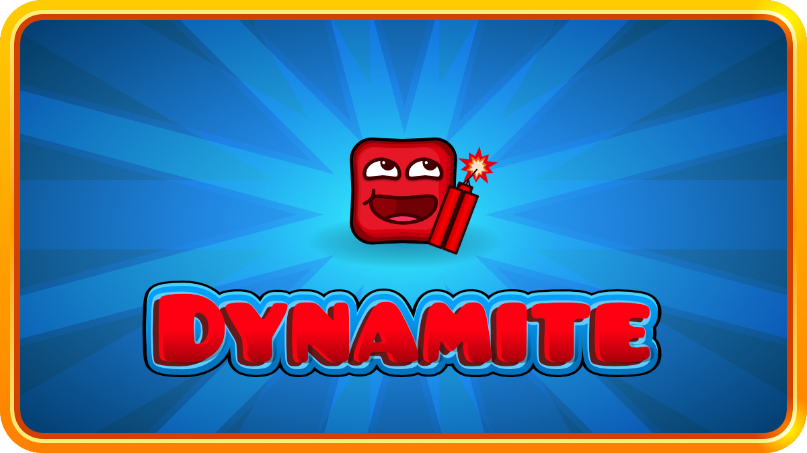

<p align="center">
    <b>***WIP*** GD "Boomlings" API wrapper library for PHP</b>
<br/>
    <i>"What if I made it go boom"</i>
</p>

# Installation
```shell
composer require hyperbolus/dynamite
```

# Usage
You should have experience using composer and how projects and dependencies work with composer's autoloader. No support will be given for you try to copy and paste the `src/` folder into your GDPS (which btw is the opposite of what this should be used for...)

# Examples
View the [examples/](examples/README.md) directory

# Coverage
Not great. v1 milestone's goal is to cover 100% functionality. Developed for the Hype CMS, so those requirements are priority

# License
Dynamite is released under the MIT License